# CSARCH2 Case Study 1

**Machine:** _Machine 1 - Integer Machine_ <br>
**Subject:** _CSARCH2_ <br>
**Section:** _S03_ <br>
**Group:** _Group 7_ <br>
**GitHub Link:** https://github.com/ainere/CSARCH2-Case-Study-1-Integer-Machine <br>
**Website Link:** https://csarch2-case-study-1-integer-machine-s03-group7.streamlit.app/ <br>
**Youtube Demo Link:** https://youtu.be/RhpEADWvhXw

## Group Members

- Alain Zuriel Marcos
- Elkan La Madrid
- Jenrick Lim
- Kent Lopez

---

## Project Overview

The **Machine 1 Integer Machine** is a functional Streamlit web application
that demonstrates fixed-width integer representation and register-level
arithmetic. It is intended to make each algorithm easier to follow by showing
both the final answer and the intermediate register states used to reach it.

The website currently includes three working tools:

1. decimal-to-binary integer conversion;
2. signed sequential multiplication (Booth's algorithm); and
3. unsigned non-restoring division.

Each tool accepts user input, validates it against the selected data size, and
displays an explanation of the result. Multiplication and division also include
complete cycle-by-cycle trace tables.

---

## Tech Stack

| Technology | Role |
| --- | --- |
| Python 3.12+ | Implements the integer algorithms, validation, and application logic |
| Streamlit | Provides the interactive web interface and technical-lab layout |
| CSS | Adds the custom colors, cards, tables, typography, and responsive styling |

### 1. Python

Python provides the calculation layer for the machine. The arithmetic modules
are separate from the interface, allowing the algorithms to be tested without
running Streamlit.

**Used for:**

- fixed-width signed and unsigned conversion;
- input parsing and range validation;
- signed sequential multiplication (Booth's algorithm) using `A`, `Q`, `Q-1`, and `M`;
- non-restoring division using `A`, `Q`, and `M`; and
- immutable result and trace records.

### 2. Streamlit

Streamlit provides the website interface. It allows the group to build a
working Python-based web application without maintaining a separate frontend
and backend.

**Used for:**

- data-size and number-format controls;
- separate Conversion, Multiplication, and Division tabs;
- inline validation messages that preserve the user's input;
- result cards and guided explanations; and
- responsive register trace tables.

---

## I. Machine Features

### 1. Decimal Integer Conversion

**Concept:** Converts one decimal integer into fixed-width binary while
evaluating its unsigned and signed two's-complement interpretations
independently.

**Inputs:**

- a decimal integer; and
- a data size from 2 to 256 bits.

**Outputs:**

- unsigned decimal and fixed-width binary, when the value fits;
- signed decimal and fixed-width two's-complement binary, when the value fits;
- minimum and maximum values for both interpretations; and
- a separate overflow message for any interpretation that cannot represent the
  input.

This separation is important because a value may fit one interpretation but
not the other. For example, `255` fits unsigned 8-bit representation but does
not fit signed 8-bit two's complement.

### 2. Sequential Multiplication

**Concept:** Demonstrates signed sequential circuit multiplication using Booth's algorithm using the `A`, `Q`, `Q-1`, and `M` registers.

**How it works:**

- `M` stores the multiplicand.
- `Q` stores the multiplier.
- `A` stores the partial product.
- `Q-1` stores the extra bit for Booth's recoding.
- The machine inspects the bit pair Q₀Q₋₁ each cycle:
  - If 10: subtract M from A (A = A - M)
  - If 01: add M to A (A = A + M)
  - If 00 or 11: no operation (copy)
- The combined `A,Q,Q-1` registers undergo an arithmetic shift right after every cycle (preserving the sign bit).
- After `n` cycles, the final product is the concatenated `A:Q` value.

The website shows the initial register state,  the action taken based on `Q0 Q-1`, the
registers before and after each shift, and the final product in decimal and
binary.

### 3. Non-Restoring Division

**Concept:** Demonstrates unsigned non-restoring division using the `A`, `Q`,
and `M` registers.

**How it works:**

- `Q` begins with the dividend.
- `M` stores the divisor.
- `A` stores the signed partial remainder.
- The combined `A,Q` registers are shifted left during each cycle.
- The machine subtracts `M` when the previous `A` is non-negative and adds `M`
  when it is negative.
- A quotient bit is assigned after each arithmetic operation.
- If the final partial remainder is negative, the machine restores it by
  adding `M`.

The website displays the quotient, remainder, final registers, optional
restoration step, and a complete cycle trace.

---

## II. Input Rules

The interface uses one shared data-size control and supports two operand
formats for multiplication and division.

| Input | Accepted values |
| --- | --- |
| Data size | Whole numbers from 2 to 256 bits; 8 bits by default |
| Conversion value | Signed base-10 integer |
| Decimal arithmetic operand | Non-negative base-10 integer |
| Binary arithmetic operand | `0` and `1`, with optional `0b` prefix, spaces, or underscores |
| Divisor | Any supported positive value; zero is rejected |

Arithmetic operands must fit the selected unsigned width. Invalid values are
reported beside the form without clearing the user's entries.

The 256-bit maximum is an interface guardrail that prevents accidentally
generating an impractically large trace table. The pure Python calculation
modules use arbitrary-precision integers and are not internally limited to 256
bits.

---

## III. Running the Website Locally

### 1. Requirements

- Python 3.12 or newer
- `pip`

### 2. Installation

Clone the repository and enter its folder:

```powershell
git clone https://github.com/ainere/CSARCH2-Case-Study-1-Integer-Machine.git
cd CSARCH2-Case-Study-1-Integer-Machine
```

Create and activate a virtual environment:

```powershell
python -m venv .venv
.\.venv\Scripts\Activate.ps1
```

Install the dependencies:

```powershell
python -m pip install -r requirements.txt
```

### 3. Start the Application

```powershell
python -m streamlit run app.py
```

Streamlit will print a local address, normally
`http://localhost:8501`. Open that address in a browser and stop the server
with `Ctrl+C` when finished.

---

## IV. Project Structure

```text
app.py                     Streamlit forms, tabs, and result presentation
integer_machine/
  conversion.py            Fixed-width signed and unsigned conversion
  multiplication.py        Unsigned sequential add-and-shift multiplier
  division.py              Unsigned non-restoring divider
  models.py                Immutable result and trace records
  parsing.py               Input validation and binary formatting
.streamlit/config.toml     Streamlit theme and server defaults
requirements.txt           Runtime dependency
```

The `integer_machine/` package is the independent teaching core. It has no
Streamlit dependency. The `app.py` file acts as the presentation layer: it
collects inputs, calls the appropriate algorithm, and renders the results.

---

## V. Test Cases

### 1. Decimal to Unsigned and Signed Binary

## Test Cases & Verification

| Test Case Name | Input | Expected Output | Screenshot |
| :--- | :--- | :--- | :---: |
| **Out-of-Bounds Positive 8-bit Integer for both** | `256` | **Unsigned:** Outside of Range<br>**Signed:** Outside of Range | 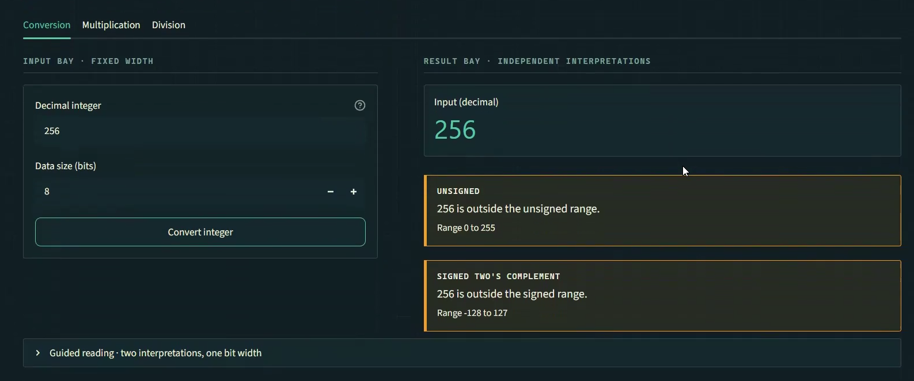 |
| **Out-of-Bounds Positive 8-bit Integer for Signed** | `255` | **Unsigned:** `1111 1111`<br>**Signed:** Outside of Range | 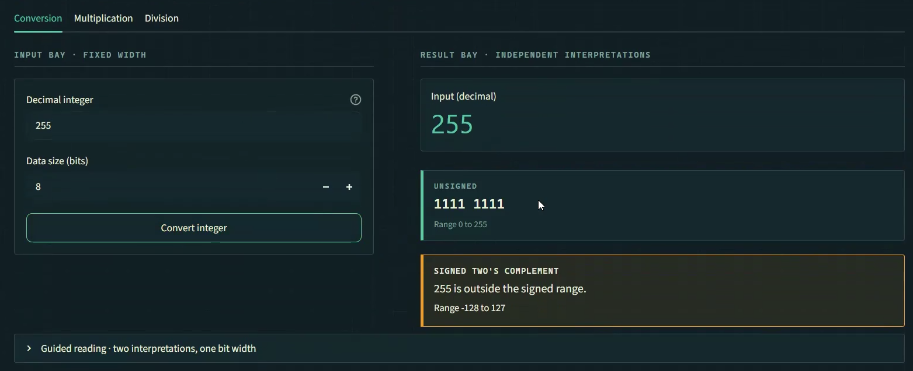 |
| **Out-of-Bounds Negative 8-bit Integer for both** | `-129` | **Unsigned:** Outside of Range<br>**Signed:** Outside of Range | 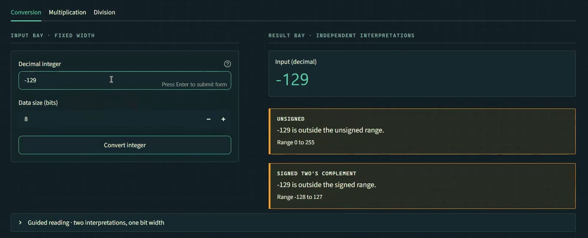 |
| **Out-of-Bounds Negative 8-bit Integer for Unsigned** | `-128` | **Unsigned:** Outside of Range<br>**Signed:** `1000 0000` | 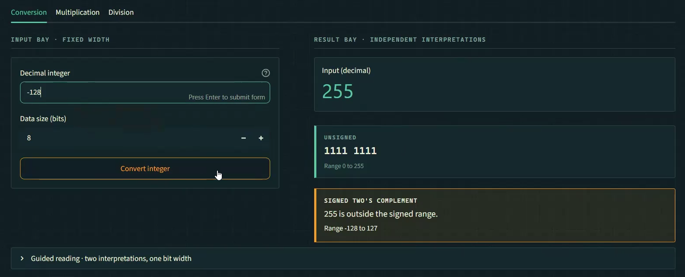 |
| **String / Character Input** | `CSARCH2` | **Unsigned:** Input must be decimal<br>**Signed:** Input must be decimal | 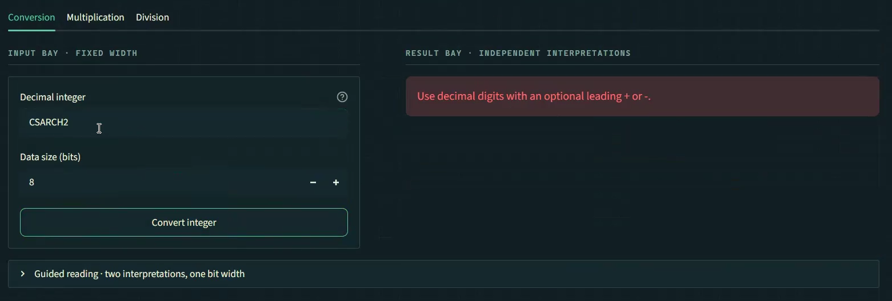 |
| **Float Input** | `4.0` | **Unsigned:** Input must be decimal<br>**Signed:** Input must be decimal | 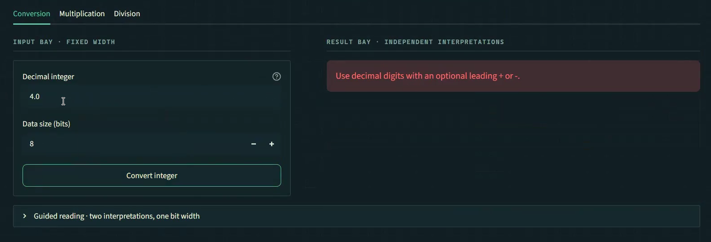 |
| **In-Bounds Positive Integer for both (8-bit)** | `127` | **Unsigned:** `0111 1111`<br>**Signed:** `0111 1111` | 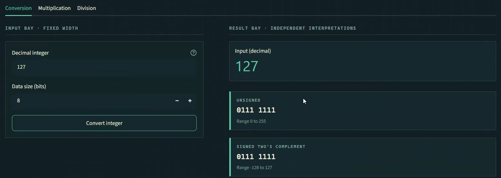 |
| **Out-of-Bounds Positive 64-bit Integer for both** | `18446744073709551616` | **Unsigned:** Outside of Range<br>**Signed:** Outside of Range | 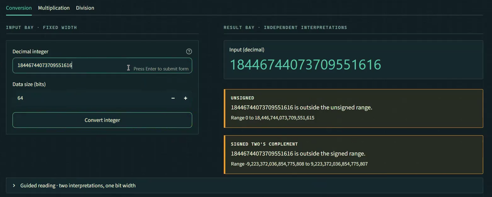 |
| **Out-of-Bounds Positive 64-bit Integer for Signed** | `18446744073709551615` | **Unsigned:** `1111 1111 1111 1111 1111 1111 1111 1111 1111 1111 1111 1111 1111 1111 1111 1111`<br>**Signed:** Outside of Range | 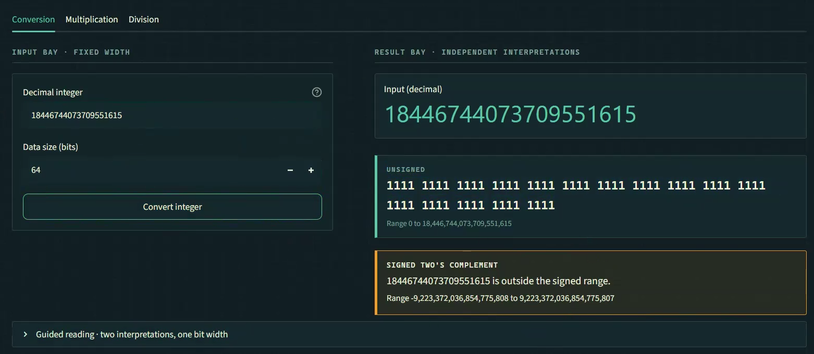 |
| **Out-of-Bounds Negative 64-bit Integer for both** | `-9223372036854775809` | **Unsigned:** Outside of Range<br>**Signed:** Outside of Range | 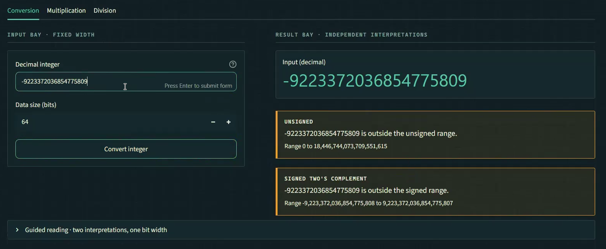 |
| **Out-of-Bounds Negative 64-bit Integer for Unsigned** | `-9223372036854775808` | **Unsigned:** Outside of Range<br>**Signed:** `1000 0000 0000 0000 0000 0000 0000 0000 0000 0000 0000 0000 0000 0000 0000 0000` | 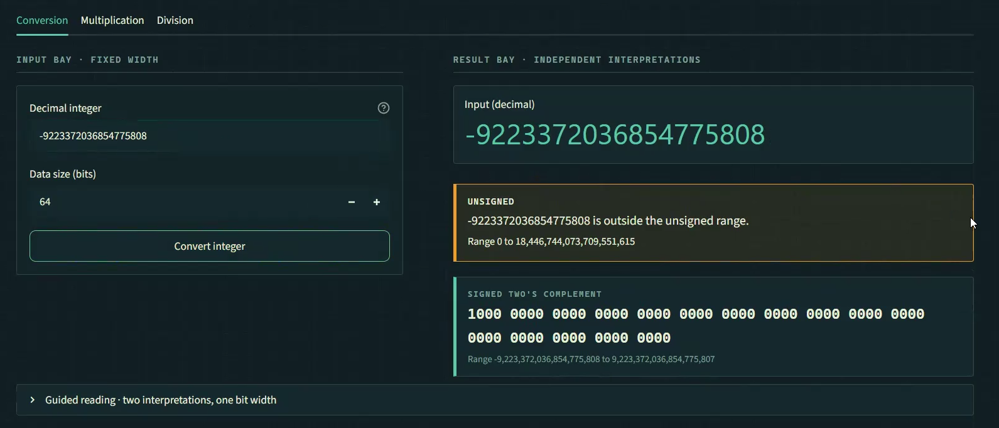 |
| **In-Bounds Positive Integer for both (64-bit)** | `1000` | **Unsigned:** `0000 0000 0000 0000 0000 0000 0000 0000 0000 0000 0000 0000 0000 0011 1110 1000`<br>**Signed:** `0000 0000 0000 0000 0000 0000 0000 0000 0000 0000 0000 0000 0000 0011 1110 1000` | 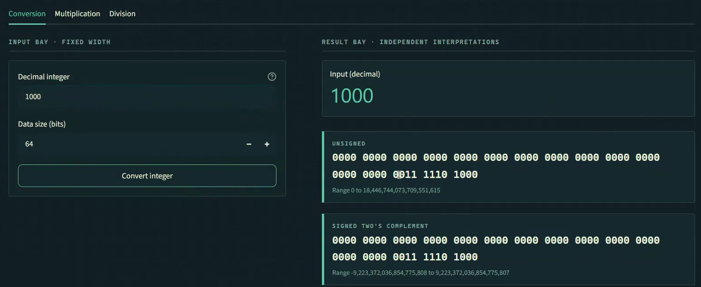 |
| **2-bit Zero** | `0` | **Unsigned:** `00`<br>**Signed:** `00` | 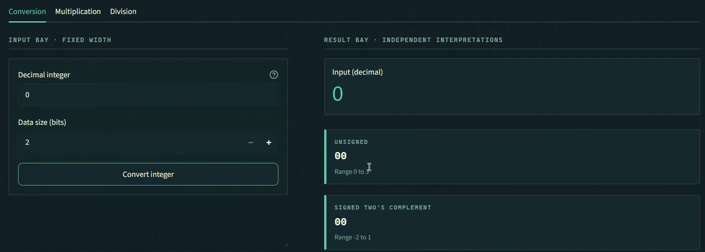 |
| **2-bit Signed Minimum** | `-2` | **Unsigned:** `-2 is outside the unsigned range`<br>**Signed:** `10` | 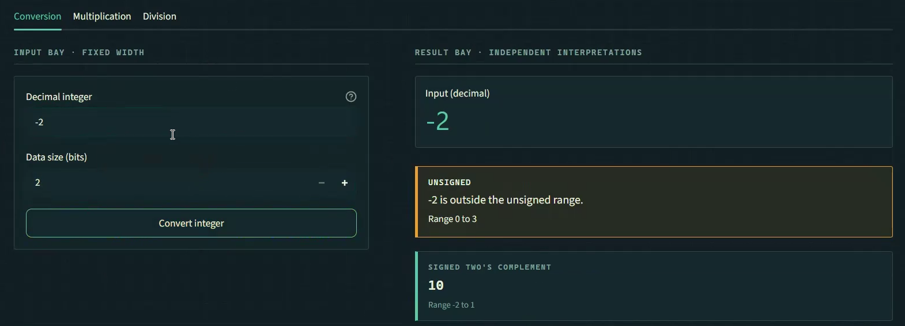 |
| **2-bit Unsigned Maximum** | `3` | **Unsigned:** `11`<br>**Signed:** Outside of Range | 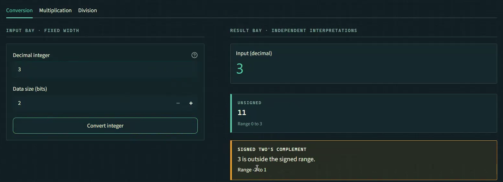 |
| **8-bit Input with Explicit Plus Sign** | `+8` | **Unsigned:** `0000 1000`<br>**Signed:** `0000 1000` | 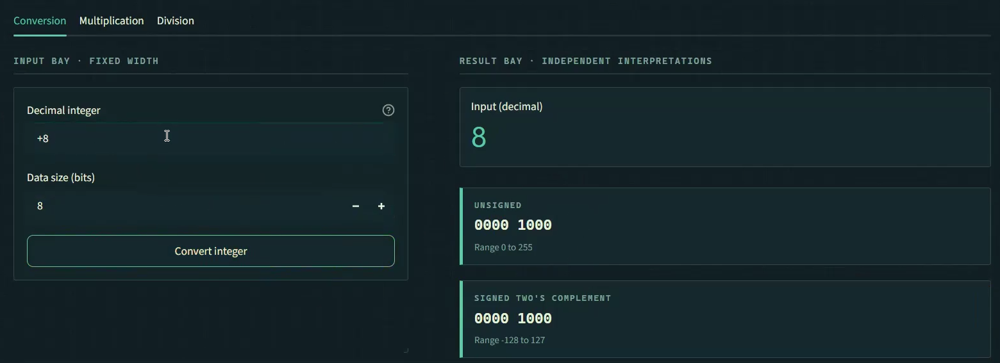 |
| **Empty Input** | *(Blank)* | **Error:** `Enter a decimal integer` | 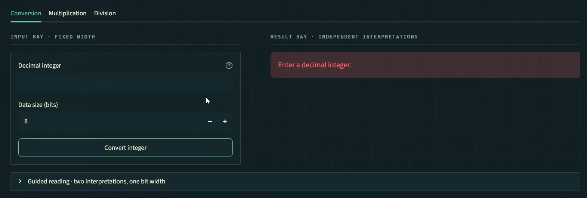 |

### 2. Sequential Circuit Binary Multiplier

| Test Case Name | Input | Expected Output | Screenshot |
| :--- | :--- | :--- | :---: |
| **8-bit Multiplier is Zero (Decimal)** | `M = 10, Q = 0` | `0000 0000` | 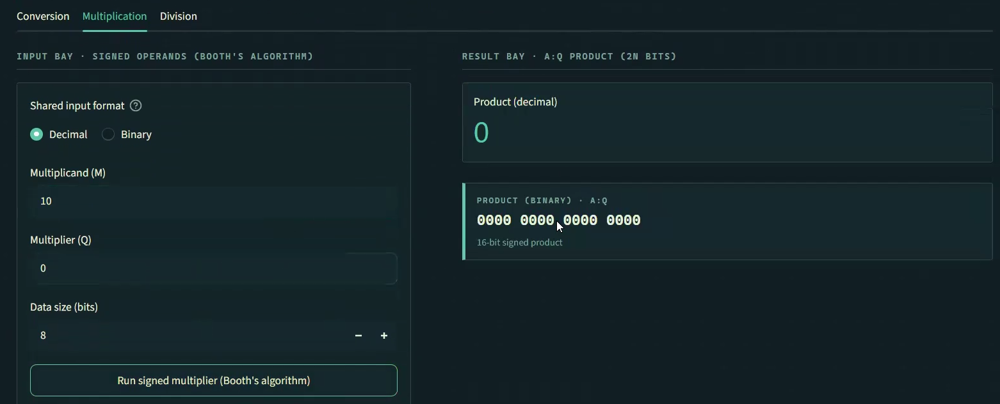 |
| **8-bit Multiplicand is Zero (Decimal)** | `M = 0, Q = 10` | `0000 0000` | 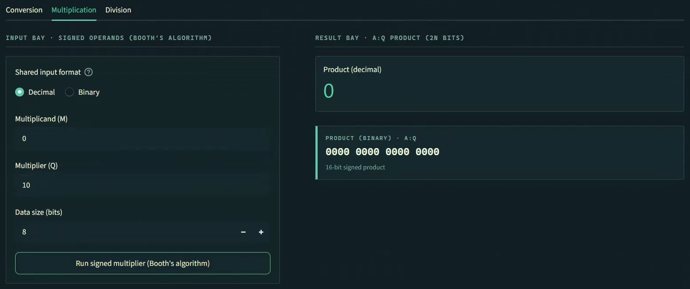 |
| **8-bit Multiplier is Zero (Binary)** | `M = 0000 0010, Q = 0000 0000` | `0000 0000` | 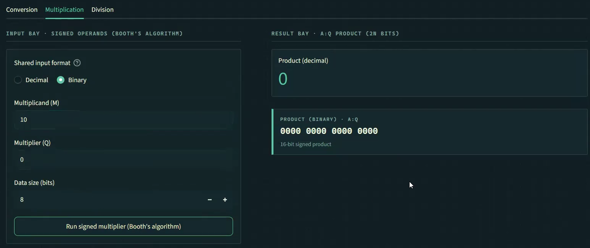 |
| **8-bit Multiplicand is Zero (Binary)** | `M = 0000 0000, Q = 0000 0010` | `0000 0000` |  |
| **8-bit Standard Multiplication (Decimal)** | `M = 5, Q = 3` | `0000 1111` | 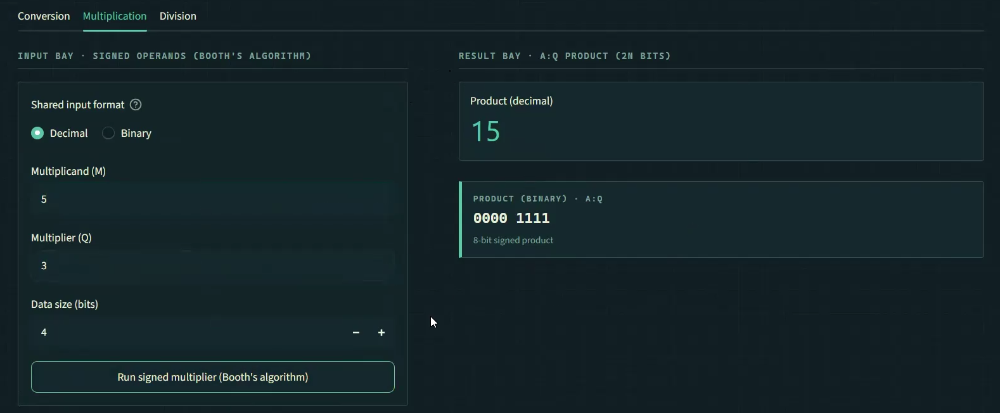 |
| **4-bit Standard Negative Multiplication (Decimal)** | `M = -5, Q = 3` | `1111 0001` | 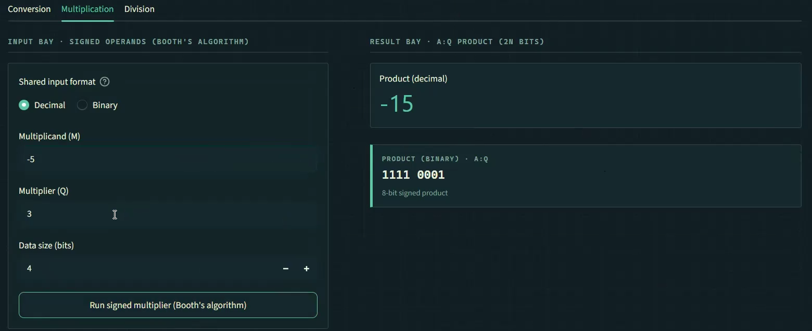 |
| **4-bit Double Negative Multiplication (Decimal)** | `M = -5, Q = -3` | `0000 1111` | 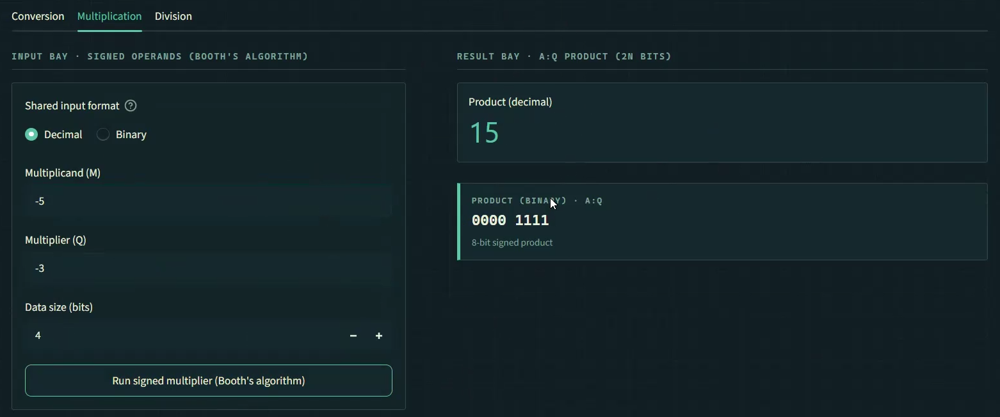 |
| **4-bit Standard Multiplication (Binary)** | `M = 0101, Q = 0011` | `0000 1111` | 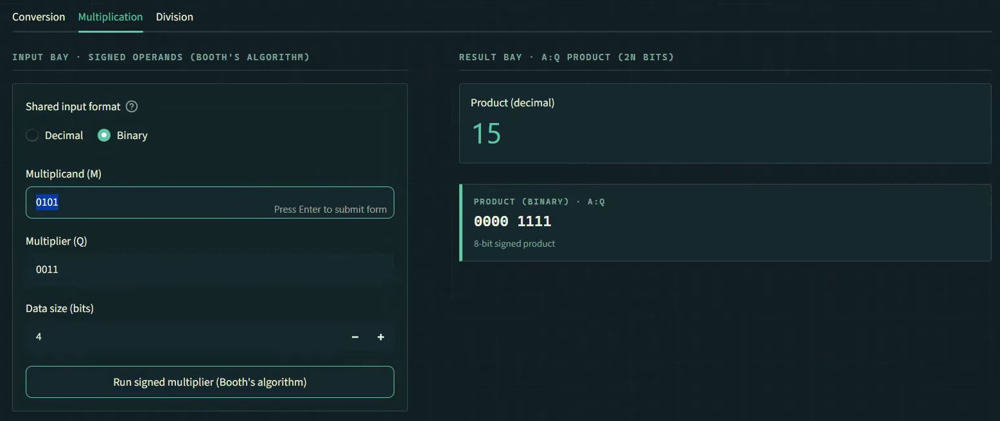 |
| **4-bit Standard Negative Multiplication (Binary - M)** | `M = 1011, Q = 0011` | `1111 0001` | 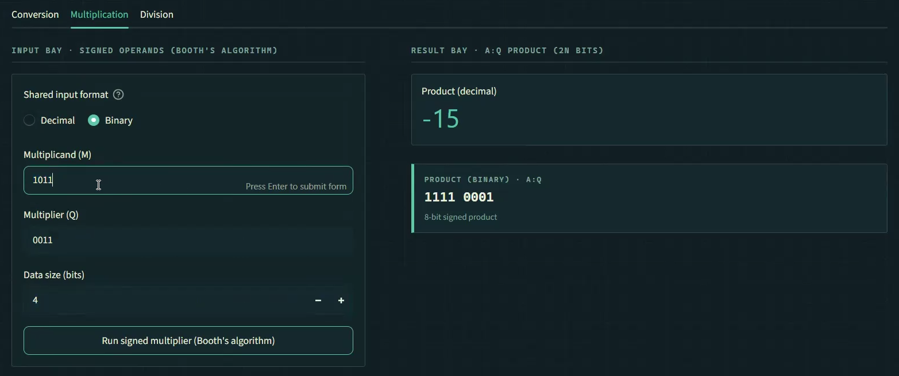 |
| **4-bit Standard Negative Multiplication (Binary - Both)** | `M = 1011, Q = 1101` | `0000 1111` | 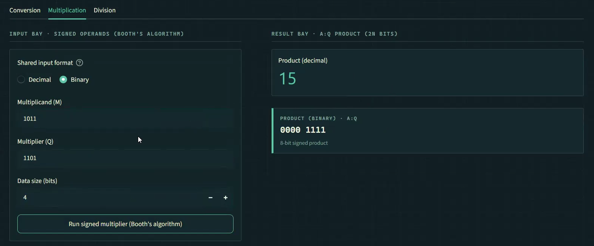 |
| **Different Length Binary Input** | `M = 1000, Q = 100` | `0010 0000` | 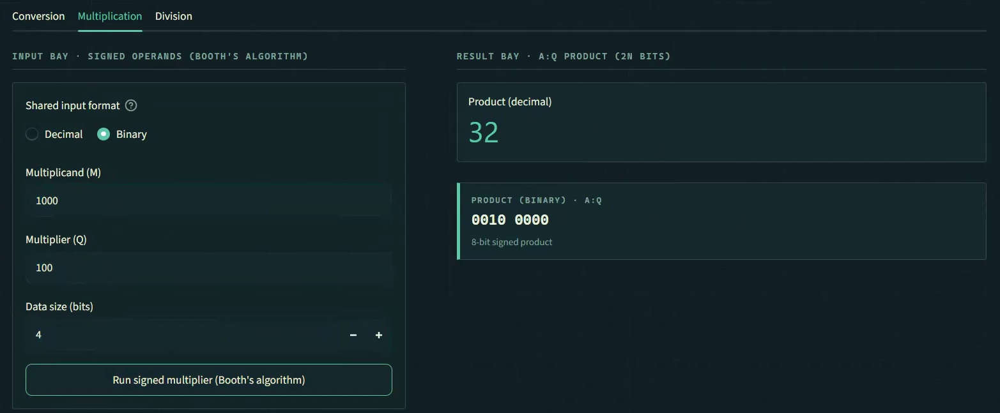 |
| **String / Character Input** | `CSARCH2` | **Error:** Invalid input | 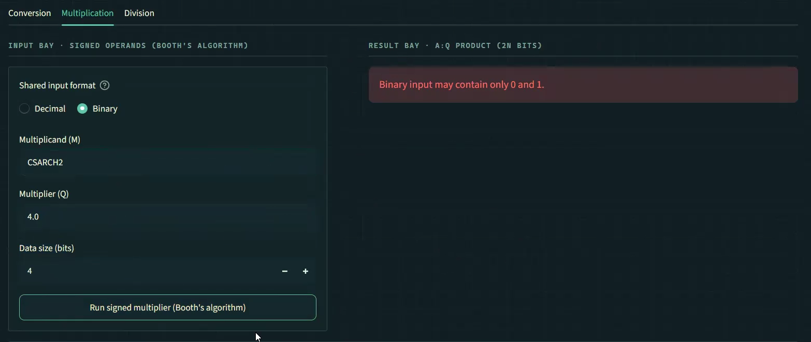 |
| **Float Input** | `4.0` | **Error:** Invalid input |  |
| **Operand Exceeds Data Size (Decimal)** | `M = 20, Q = 4 (Data size = 4)` | **Error:** `Value does not fit in 4 unsigned bits` | 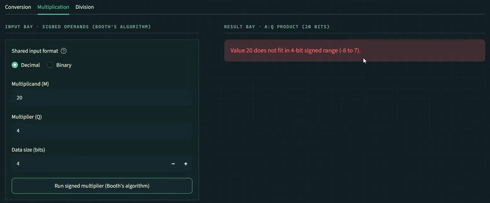 |
| **Operand Exceeds Data Size (Binary)** | `M = 10000, Q = 100 (Data size = 4)` | **Error:** `Binary input exceeds the selected 4-bit size` | 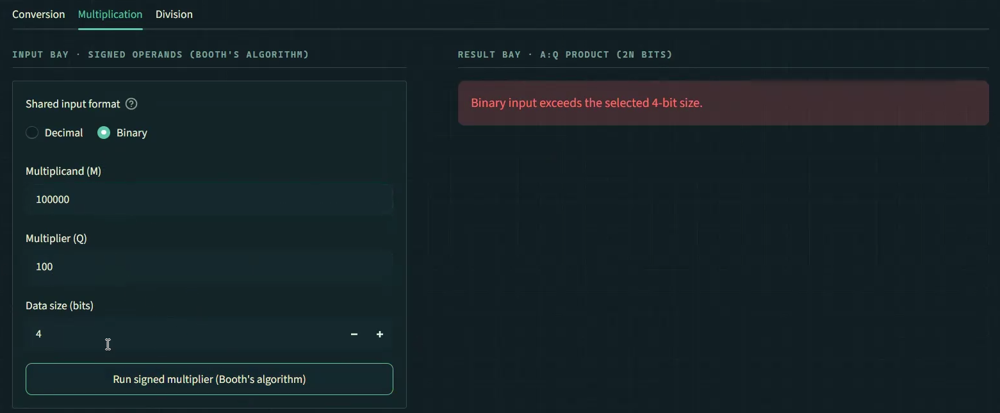 |
| **Empty Input (Decimal)** | `M = (Blank), Q = (Blank)` | **Error:** `Enter a decimal integer.` | 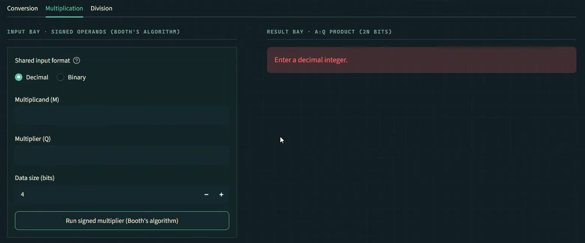 |
| **Empty Input (Binary)** | `M = (Blank), Q = (Blank)` | **Error:** `Enter a binary value.` |  |

### 3. Non-restoring Division

| Test Case Name | Input | Expected Output | Screenshot |
| :--- | :--- | :--- | :---: |
| **4-bit Dividend is Zero (Decimal)** | `Q = 0, M = 10` | `0000 0000` | 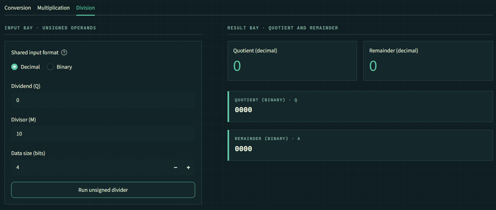 |
| **4-bit Divisor is Zero (Decimal)** | `Q = 10, M = 0` | **Error:** Division by zero | 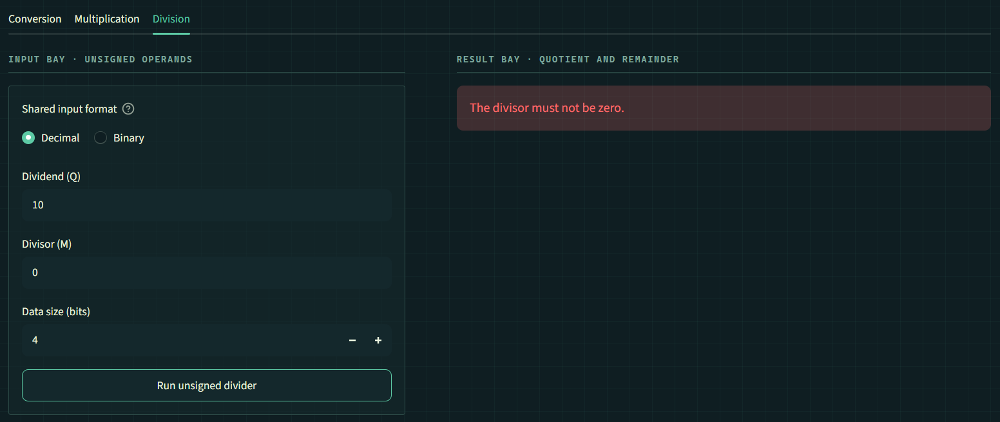 |
| **4-bit Dividend is Zero (Binary)** | `Q = 0000, M = 1000` | `0000 0000` | 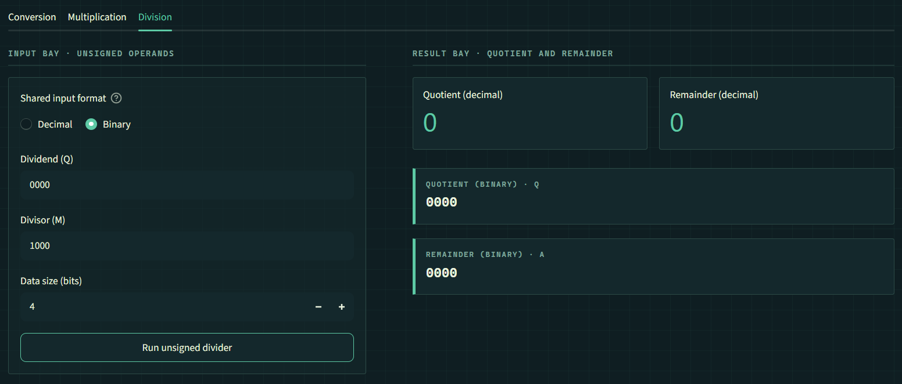 |
| **4-bit Divisor is Zero (Binary)** | `Q = 1000, M = 0000` | **Error:** Division by zero | 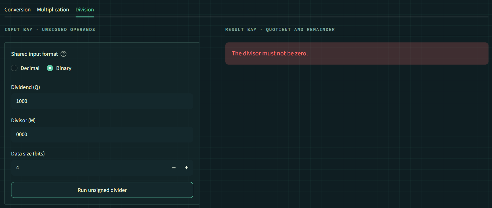 |
| **4-bit Standard Division w/o Remainder (Decimal)** | `Q = 12, M = 4` | `0000 0011` *(3)* | 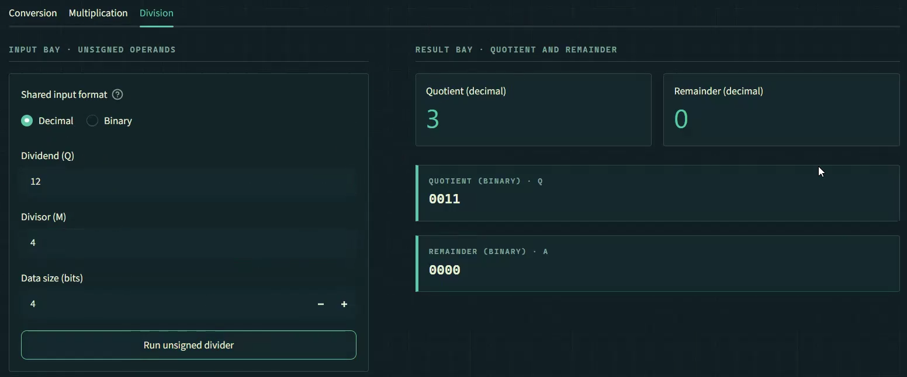 |
| **4-bit Standard Division w/ Remainder (Decimal)** | `Q = 11, M = 4` | `0011 0010` *(2 r 3)* | 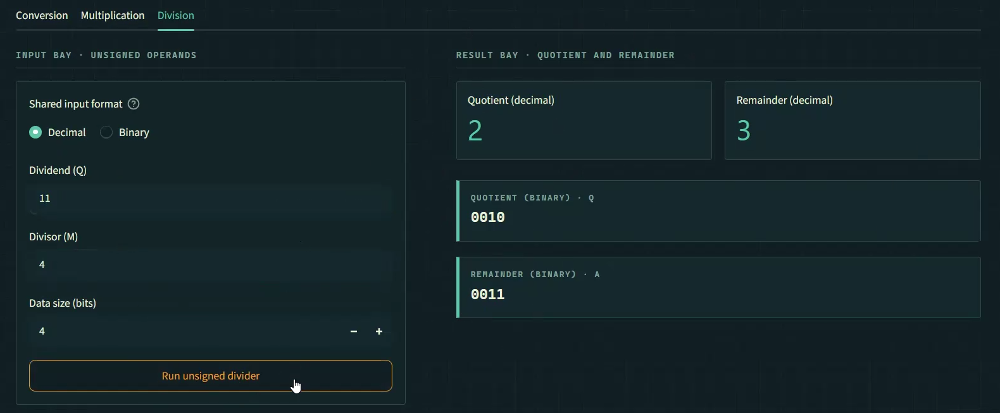 |
| **4-bit Standard Division w/o Remainder (Binary)** | `Q = 1100, M = 0100` | `0000 0011` *(3)* |  |
| **4-bit Standard Division w/ Remainder (Binary)** | `Q = 1011, M = 0100` | `0011 0010` *(2 r 3)* | 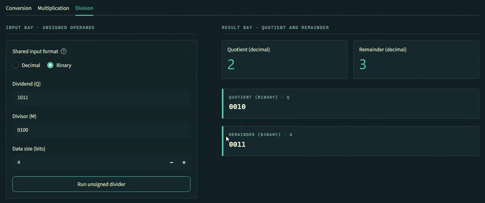 |
| **String / Character Input** | `CSARCH2` | **Error:** Invalid input | 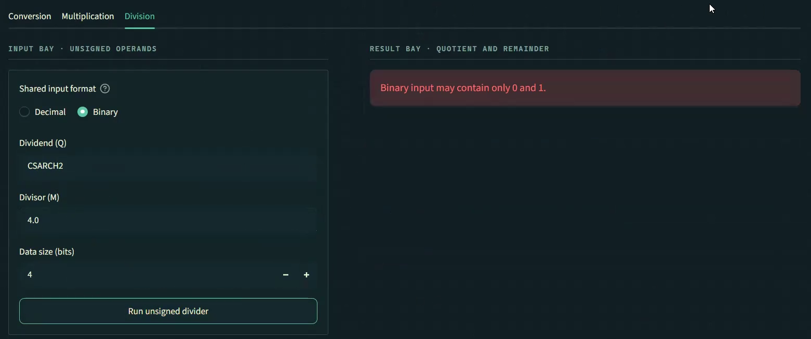 |
| **Float Input** | `4.0` | **Error:** Invalid input |  |
| **Negative Dividend** | `Q = -10, M = 4 (Data size = 8)` | **Error:** `Arithmetic operands must be unsigned` | 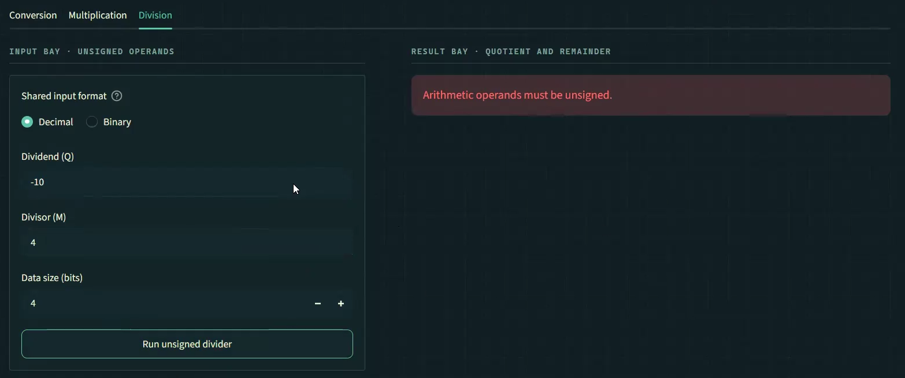 |
| **Negative Divisor** | `Q = 2, M = -4 (Data size = 8)` | **Error:** `Arithmetic operands must be unsigned` | 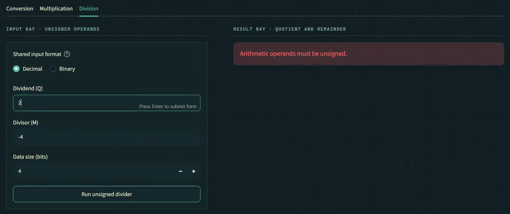 |
| **Operand Exceeds Data Size (Decimal)** | `Q = 20, M = 4 (Data size = 4)` | **Error:** `Value does not fit in 4 unsigned bits.` | 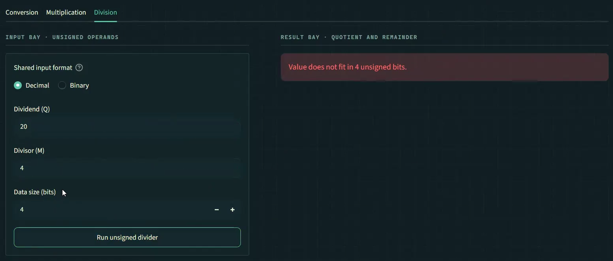 |
| **Operand Exceeds Data Size (Binary)** | `Q = 10000, M = 10 (Data size = 4)` | **Error:** `Binary input exceeds the selected 4-bit size.` | 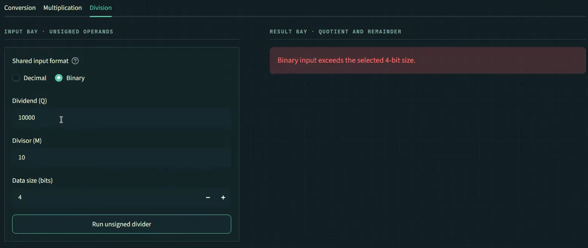 |

---

# Development Documentation

## All Technical and Creative Accomplishments

- Created a working Streamlit website with a responsive technical-laboratory
  visual style.
- Implemented independent unsigned and signed fixed-width conversion results.
- Implemented signed sequential multiplication (Booth's algorithm) with complete `A,Q,Q-1,M` register traces.
- Implemented unsigned non-restoring division with complete `A,Q,M` traces and
  final remainder restoration.
- Added decimal and binary operand formats with readable grouped binary output.
- Added inline validation while retaining the user's entered values.
- Separated the arithmetic core from the Streamlit presentation layer.
- Documented local installation, execution, input rules, limitations, and
  project structure.

## Current Limitations and Pending Work

- Division currently supports **unsigned operands only**.
- Signed division is not implemented.
- Calculations are not saved after the application session ends.
- Per-cycle animation is not included; the complete states are presented in
  tables instead.
- Representative screenshots still need to be added.
- Repository visibility should be confirmed before final submission.
- A public 5-8 minute YouTube walkthrough still needs to be recorded and linked.
- Live website deployment is still pending.

## Completed Checking

- All 48 local development tests passed before preparing the clean repository.
- Python compilation checks passed for the application and calculation package.
- A separate 65-bit multiplication and division smoke check matched Python's
  arithmetic results.
- Desktop and mobile-width browser layouts were reviewed.
- The complete branch received a final review with no critical or important
  findings.

---
